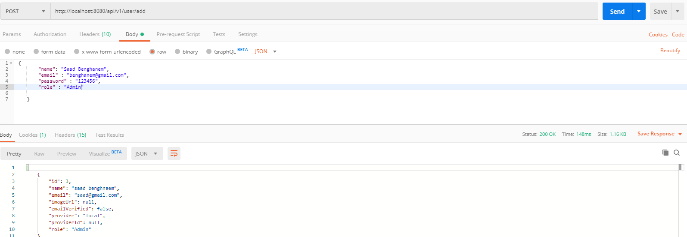
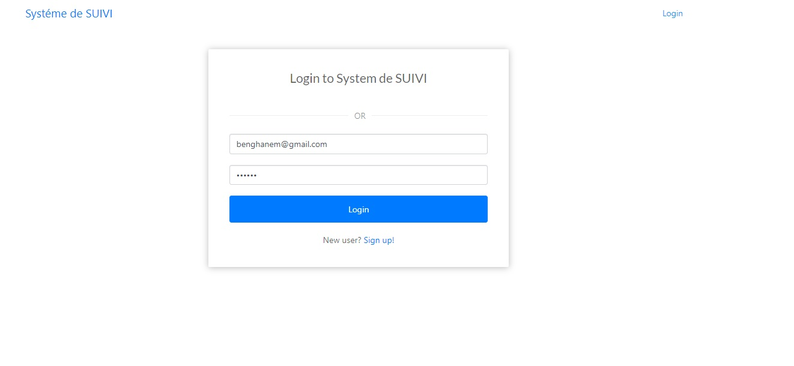
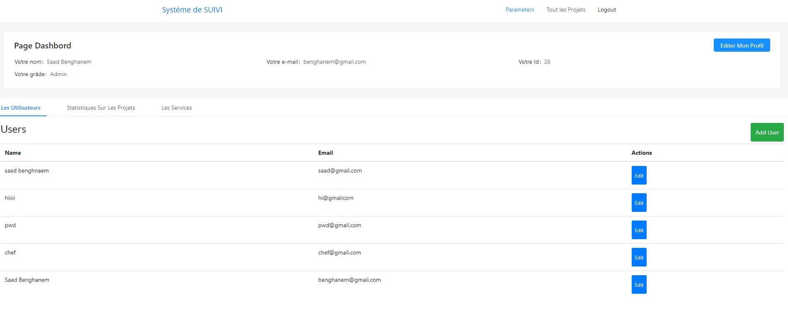
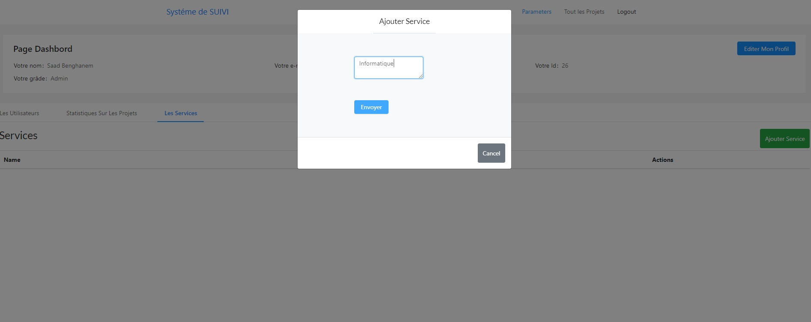
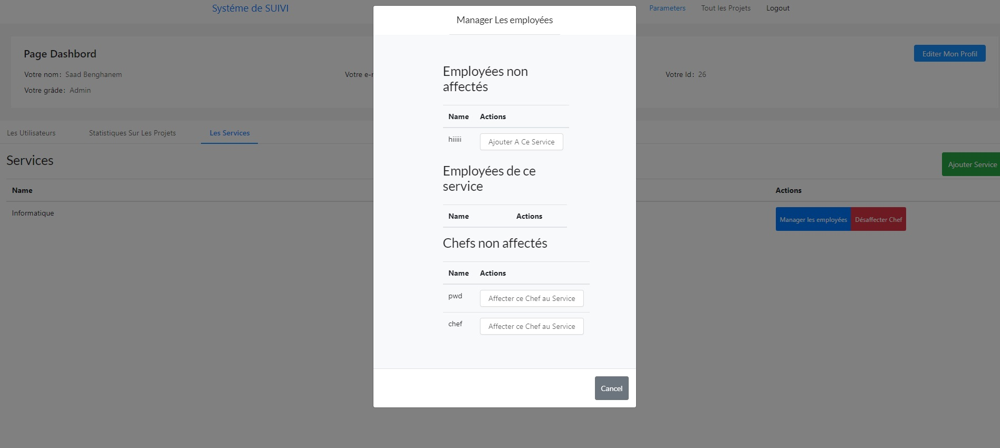
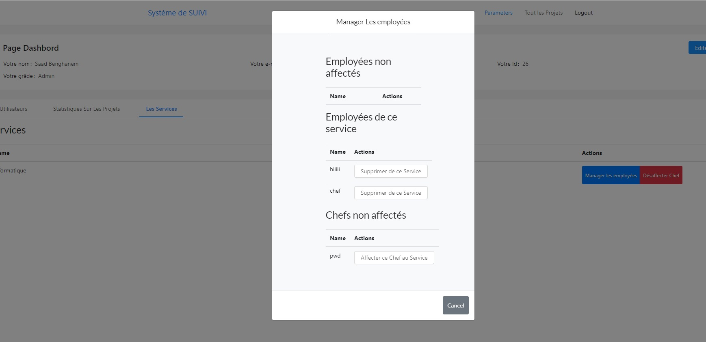
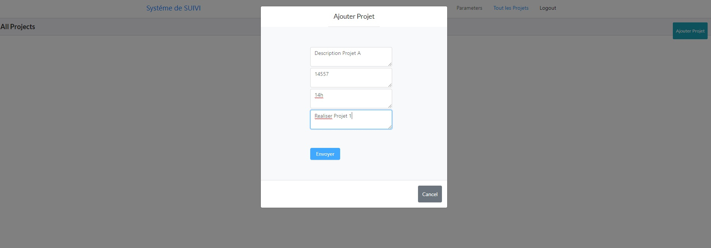
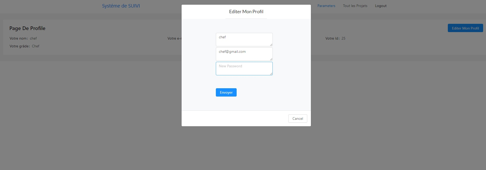
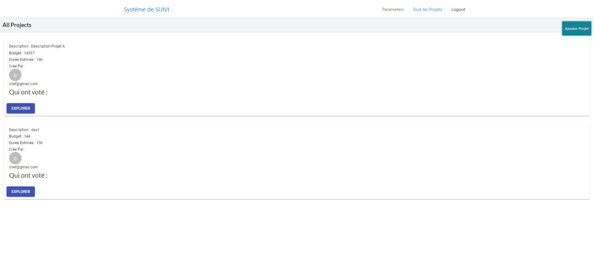
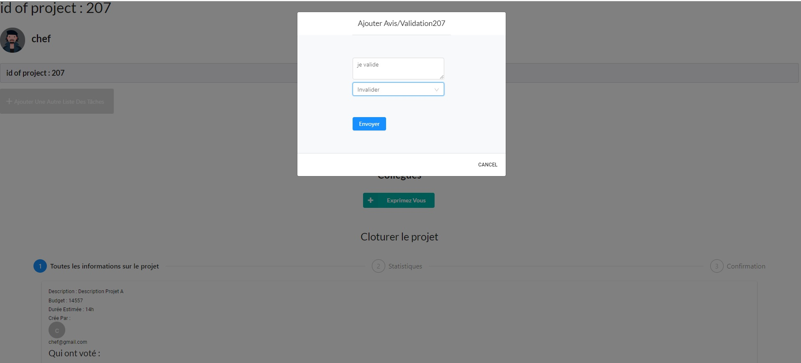
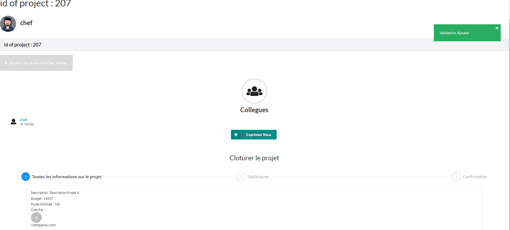
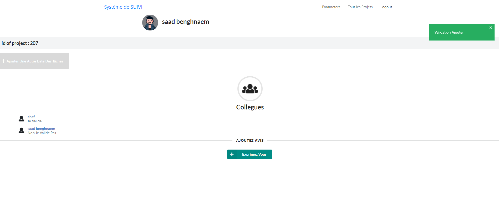


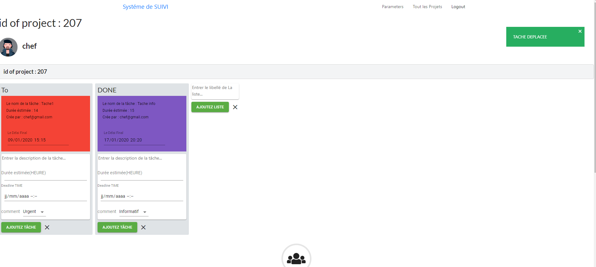
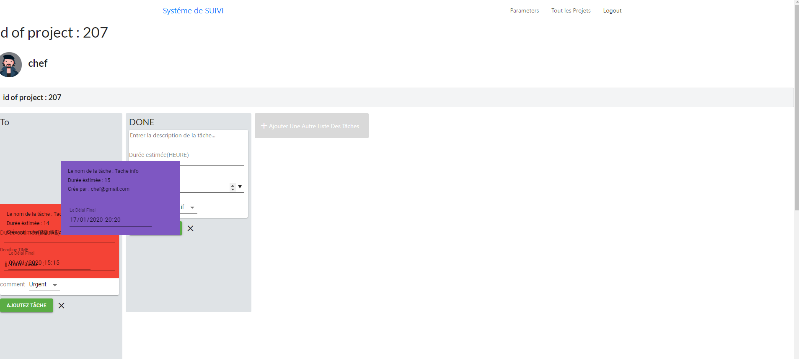


## Setting up the Backend Server (spring-social)

+ **Create MySQL database**

	```bash
	mysql> create database spring_social
	```
+ **Or Import Our database**

	```
	In Same Folder U Will Find "spring_social.sql"
	```


+ **Configure database username and password**

	```yml
	# spring-social/src/main/resources/application.yml
	spring:
	    datasource:
	        url: jdbc:mysql://localhost:3306/spring_social?useSSL=false
	        username: <YOUR_DB_USERNAME>
	        password: <YOUR_DB_PASSWORD>
	```


+ **Run spring**

	```bash
	mvn spring-boot:run
	```

## Setting up the Frontend Server (react)

```bash
cd react
npm install && npm start
```